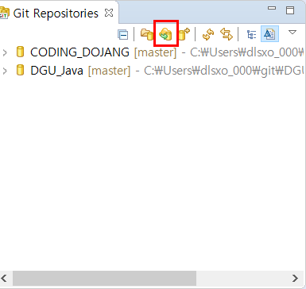
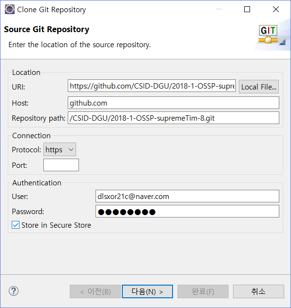
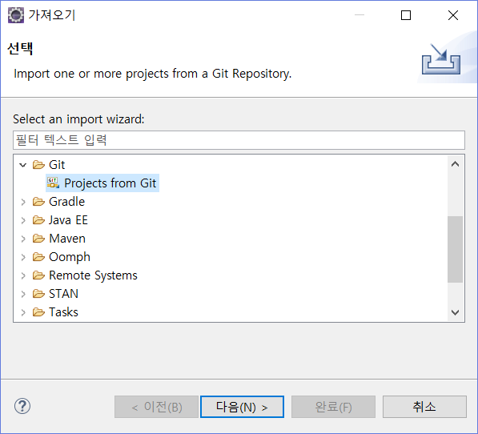
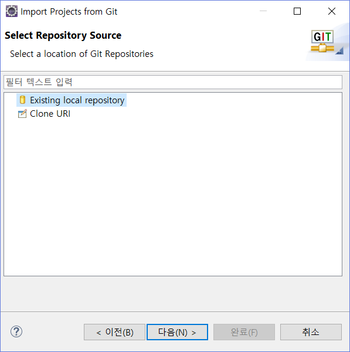

# 프로젝트명
> 동국대 공개SW프로젝트 전공 과목의 8조 supremeTim 프로젝트입니다.

오픈소스기반의 기존 테트리스 게임에 추가적인 기능을 더해서 만든 8조만의 테트리스 게임 프로젝트입니다.

## 컴파일 환경 만들기
1. 이클립스(윈도우/우분투):

  * 저장소 복제
  
  
  
  
  
  

  * maven 설정
  
  ![]./_etc/maven1.png)
  ![]./_etc/maver2.PNG)
  
2. 리눅스 우분투

   * 현재 방법 찾는 중...

## 게임 실행 방법
> 서버는 고정IP 사용이 필요합니다.

1. 랜선 연결 혹은 고정 IP 설정

2. 리눅스 하마치를 이용

  *하마치 설치 : https://openwiki.kr/tech/hamachi_for_linux_command_line_version

  ![]./_etc/socket.PNG)

  *빨간 박스 쳐저 있는 주소를 클라이언트 생성 시 주소를 입력할 때 사용
  
> 게임 실행 과정

서버로 접속 -> 리듬게임 버튼 클릭 -> 시작하기 -> 1P 리듬게임 모드

                    -> 시작하기 -> 1P 모드          
                    
                    -> 다른 플레이어가 클라이언트로 접속 -> IP/PORT 같도록 설정 -> 2P 모드(플레이어 추가 가능) -> 서버가 시작하기 버튼 클릭

## 기타 오류 해결방법
> 한글이 깨졌을 경우

![]./_etc/korean.PNG)

## 문의
*조인택(소켓프로그래밍, 아이템)
  *메일 : dlsxor21c@naver.com
  
*양시연(리듬게임)
  *메일 : mn04098@naver.com
  
*박선희(디비)
  *메일 : hl2ozs@naver.com

## 전 프로젝트
https://github.com/CSID-DGU/2017-2-OSSP-jalhaebojo-2.git
