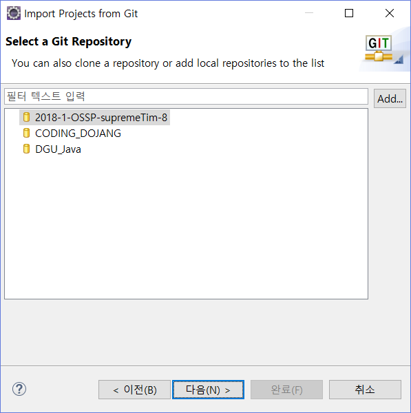
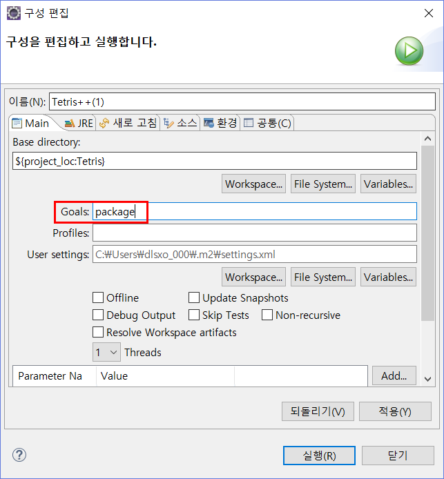
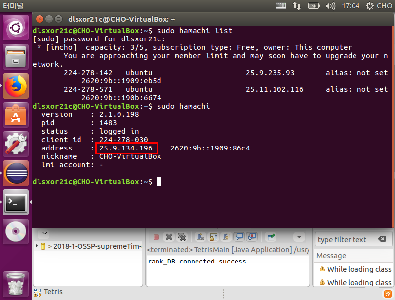
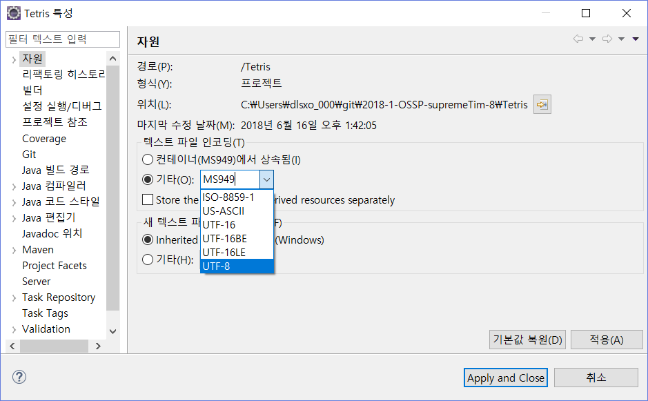

# 프로젝트명
> 동국대 공개SW프로젝트 전공 과목의 8조 supremeTim 프로젝트입니다.

오픈소스기반의 기존 테트리스 게임에 추가적인 기능을 더해서 만든 8조만의 테트리스 게임 프로젝트입니다.

## 컴파일 환경 만들기
1. 이클립스(윈도우/우분투):

  * 저장소 복제
  
  
  
  
  
  

  * maven 설정
  
  
  
  
2. 리눅스 우분투

   * 현재 방법 찾는 중...

## 게임 실행 방법
> 서버는 고정IP 사용이 필요합니다.

1. 랜선 연결 혹은 고정 IP 설정

2. 리눅스 하마치를 이용

 * 하마치 설치 : https://openwiki.kr/tech/hamachi_for_linux_command_line_version

  

 * 빨간 박스 쳐저 있는 주소를 클라이언트 생성 시 주소를 입력할 때 사용
  
  
> 게임 실행 과정

- 무조건 서버를 만들고나서 게임 종류 선택
- 리듬게임을 선택하고 시작하기를 누르면 1p 리듬게임 모드
- 그냥 시작하기를 누르면 1p 모드
- 클라이언트가 접속하고 시작하기를 누르면 멀티플레이 

## 기타 오류 해결방법
> 한글이 깨졌을 경우

  

## 문의
* 조인택(소켓프로그래밍, 아이템)
  * 메일 : dlsxor21c@naver.com
  
* 양시연(리듬게임)
  * 메일 : mn04098@naver.com
  
* 박선희(디비)
  * 메일 : hl2ozs@naver.com

## 전 프로젝트
https://github.com/CSID-DGU/2017-2-OSSP-jalhaebojo-2.git
